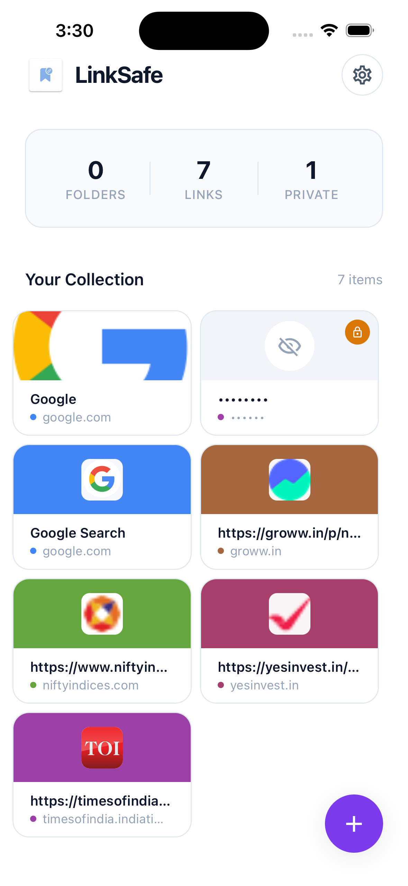
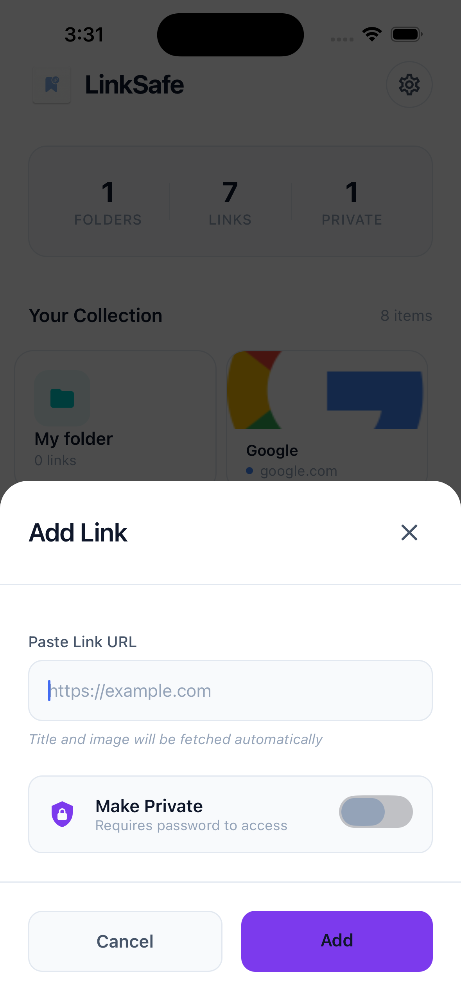
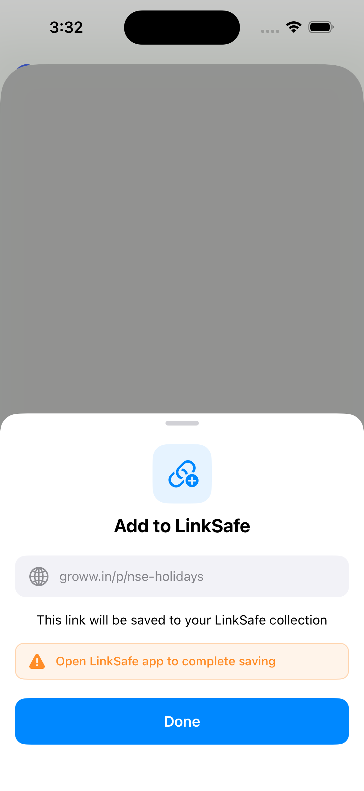

# 🔗 LinkSafe

<p align="center">
  
</p>

<p align="center">
  <strong>Your Personal Link Vault</strong><br>
  Securely save, organize, and access your important links on iOS and Android
</p>

<p align="center">
  
  
  
  
</p>

---

## ✨ Features

### 📁 **Folder Organization**
- Create custom folders to categorize your links
- Choose from 20+ folder icons and 8 beautiful colors
- Nested organization for better link management

### 🔐 **Privacy & Security**
- **Encrypted Storage** - All data stored with AES-256 encryption
- **Password Protection** - Lock individual folders or links
- **Biometric Support** - Unlock with Face ID / Touch ID (coming soon)
- **No Cloud Sync** - Your data stays on your device

### 🔗 **Link Management**
- Save any URL with title and description
- Automatic favicon fetching
- Link preview with Open Graph images
- Copy links to clipboard with one tap
- Open links in your default browser

### 📤 **Share Extension** (iOS & Android)
- Share links directly from Safari, Chrome, or any app
- **iOS**: Native Share Extension with queue system
- **Android**: Share Intent support
- Automatic duplicate detection

### 🎨 **Beautiful UI**
- Modern dark theme with gradient accents
- Smooth animations and transitions
- Card-based design with glassmorphism effects
- Custom icons using Material Community Icons

---

## 📱 Screenshots

<p align="center">
  
  
  
  
</p>

---

## 🚀 Getting Started

### Prerequisites

- Node.js >= 20
- npm or yarn
- Xcode 14+ (for iOS)
- Android Studio (for Android)
- CocoaPods (for iOS)

### Installation

1. **Clone the repository**
   ```bash
   git clone https://github.com/yourusername/LinkSafe.git
   cd LinkSafe
   ```

2. **Install dependencies**
   ```bash
   npm install
   ```

3. **iOS Setup**
   ```bash
   cd ios
   pod install
   cd ..
   ```

4. **Run the app**
   ```bash
   # Start Metro bundler
   npm start

   # Run on iOS
   npm run ios

   # Run on Android
   npm run android
   ```

---

## 🏗️ Project Structure

```
LinkSafe/
├── src/
│   ├── components/          # Reusable UI components
│   │   ├── AddEditModal.tsx    # Add/Edit link & folder modal
│   │   ├── LinkCard.tsx        # Link display card
│   │   ├── FolderCard.tsx      # Folder display card
│   │   ├── PasswordModal.tsx   # Password unlock modal
│   │   └── EmptyState.tsx      # Empty state placeholder
│   ├── screens/             # App screens
│   │   ├── HomeScreen.tsx      # Main screen with links & folders
│   │   └── FolderScreen.tsx    # Folder contents screen
│   ├── context/             # React Context providers
│   │   └── AppContext.tsx      # Global state management
│   ├── theme/               # Styling
│   │   └── index.ts            # Colors, fonts, spacing
│   └── utils/               # Utility functions
│       ├── storage.ts          # Encrypted storage operations
│       ├── encryption.ts       # AES encryption helpers
│       ├── constants.ts        # App constants
│       ├── linkPreview.ts      # Link metadata fetching
│       └── shareIntent.ts      # Share intent URL extraction
├── android/                 # Android native code
│   └── app/src/main/java/com/linksafe/
│       ├── MainActivity.kt        # Android entry point
│       ├── ShareIntentModule.kt   # Share intent handler
│       └── ShareIntentPackage.kt  # Native module package
├── ios/                     # iOS native code
│   ├── LinkSafe/
│   │   ├── AppDelegate.swift      # iOS entry point
│   │   ├── ShareIntentModule.swift # Share intent handler
│   │   └── ShareIntentModule.m    # Obj-C bridge
│   └── ShareExtension/           # iOS Share Extension
│       ├── ShareViewController.swift
│       └── Info.plist
└── App.tsx                  # Root component
```

---

## 🔧 Technical Details

### Storage Architecture

LinkSafe uses a multi-layer encryption approach:

```
┌─────────────────────────────────────┐
│         React Native App            │
├─────────────────────────────────────┤
│    react-native-encrypted-storage   │
├─────────────────────────────────────┤
│      AES-256 Encryption Layer       │
├─────────────────────────────────────┤
│   iOS: Keychain | Android: Keystore │
└─────────────────────────────────────┘
```

### Share Extension Flow (iOS)

```
Safari/Chrome → Share Extension → App Groups → Main App → Encrypted Storage
     │                │                │           │
     │                ▼                │           │
     │         Queue System            │           │
     │         (Multiple URLs)         │           │
     │                │                │           │
     └────────────────┴────────────────┴───────────┘
```

### Key Dependencies

| Package | Purpose |
|---------|---------|
| `react-native-encrypted-storage` | Secure encrypted storage |
| `crypto-js` | AES encryption |
| `@react-navigation/stack` | Stack navigation |
| `react-native-vector-icons` | Material icons |
| `uuid` | Unique ID generation |
| `@react-native-clipboard/clipboard` | Clipboard access |

---

## 🛡️ Privacy

LinkSafe is designed with privacy as a core principle:

- **100% Offline** - No internet required, no data sent to servers
- **No Analytics** - No tracking, no telemetry
- **No Ads** - Completely ad-free
- **Open Source** - Fully auditable code
- **Local Encryption** - All data encrypted on device

---

## 📝 Changelog

### Version 1.0.0 (January 2026)
- 🎉 Initial release
- ✅ Folder organization with icons and colors
- ✅ Link saving with previews
- ✅ Password protection
- ✅ iOS Share Extension
- ✅ Android Share Intent
- ✅ Dark theme UI

---

## 🤝 Contributing

Contributions are welcome! Please read our [Contributing Guide](CONTRIBUTING.md) for details.

1. Fork the repository
2. Create your feature branch (`git checkout -b feature/amazing-feature`)
3. Commit your changes (`git commit -m 'Add amazing feature'`)
4. Push to the branch (`git push origin feature/amazing-feature`)
5. Open a Pull Request

---

## 📄 License

This project is licensed under the MIT License - see the [LICENSE](LICENSE) file for details.

---

## 👨‍💻 Author

**Akash Kumar**

- GitHub: [@akashkumar](https://github.com/akashkumar)

---

## 🙏 Acknowledgments

- [React Native](https://reactnative.dev/) - The framework
- [Material Community Icons](https://materialdesignicons.com/) - Beautiful icons
- [React Navigation](https://reactnavigation.org/) - Navigation library

---

<p align="center">
  Made with ❤️ using React Native
</p>
